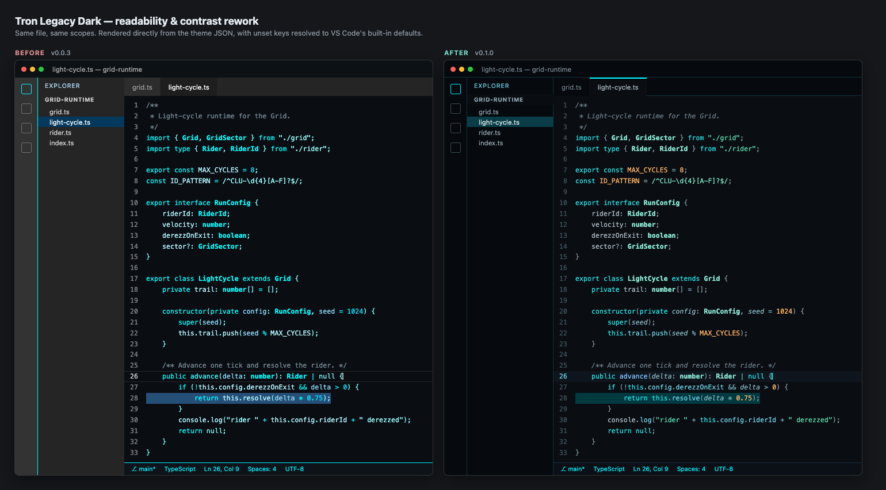
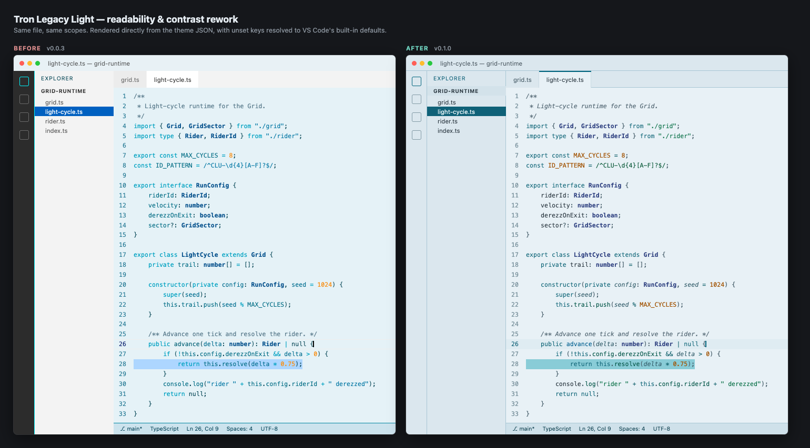

# Change Log

All notable changes to the "tron-legacy-theme" extension will be documented in this file.

## [0.1.0] - 2026-07-30

A readability and accessibility rework of both themes. The Tron identity is unchanged —
near-black surfaces, cyan edge lighting, Clu amber — but the palette now does the job
syntax highlighting is supposed to do: telling token roles apart without straining.

### Tron Legacy Dark

### Tron Legacy Light

### Fixed

- **Light theme contrast failures.** Numbers (`#F7931E`, 2.01:1) and keywords
  (`#00A1C1`, 2.68:1) fell below the 3:1 floor; comments (3.95:1) and strings (4.46:1)
  were under AA. Every token in both themes now clears 4.5:1 against its own background.
- **Duplicate token colors.** Keywords and class names were the same color in the dark
  theme (`#00FFFF`); import keywords and class names were the same in the light theme
  (`#004E8A`). Functions and keywords were 2.6 ΔE apart — indistinguishable in body text.
- **Glare on the dark theme.** Nearly every token sat at 15.5–16.7:1 against near-black —
  brighter, relative to its background, than white on black. Body text now runs at 9.5:1
  with a deliberate luminance ramp, so accents stand out instead of everything competing.
- **Selection readability.** Dimmed tokens dropped to 2.33:1 (dark) and 2.98:1 (light) on
  top of a selection. Selection colors are now chosen so the dimmest token still clears 3:1.
- **Chrome inherited from the wrong base.** Only 12 color keys were set, so the sidebar,
  tab bar, and widgets fell back to VS Code defaults tuned for `#1E1E1E` / `#FFFFFF`.
  On the dark theme that made chrome *lighter* than the editor, inverting the depth
  hierarchy; on the light theme a neutral grey `#F3F3F3` sat beside a blue-tinted editor.
- **Light/dark drift.** `support.type.property-name.json` was scoped in the dark theme
  only, so JSON keys were colored in one variant and not the other.

### Added

- **Amber accent** (`#ffb365` dark / `#a05100` light) for numbers, constants, enum members,
  escapes, and decorators — the Clu/orange-team counterpoint to the cyan Grid palette,
  and the one role that most needs to stand out.
- **`fontStyle` differentiation**: italic comments and parameters, bold types and classes.
  When hue variation is narrow, weight and slant carry differentiation that color cannot.
- **Expanded token coverage**, from 9 rules to 27: operators, punctuation, language
  constants, string escapes, regular expressions, interfaces and namespaces, object
  properties, tags and attributes, decorators, markdown, and diff markers. Previously
  large stretches of code — including most punctuation and operators — fell through to
  the default foreground at full brightness.
- **Semantic highlighting** (`semanticHighlighting: true` plus `semanticTokenColors`), so
  TypeScript, Java, Rust, and Python resolve consistently instead of letting VS Code's
  semantic layer partially override the theme.
- **Full UI color coverage**, from 12 keys to 160+: selection, find match, word highlight,
  line numbers, cursor, indent guides, bracket-pair colors pulled into the palette
  (previously gold, orchid, and blue from the defaults), a full 16-color terminal palette,
  lists, inputs, widgets, menus, git decorations, and diff colors.

### Changed

- Light editor background nudged from `#e5f2f7` to `#e8f1f6` — slightly lighter and less
  saturated, which buys the contrast headroom the darker amber needs.
- Cursor is now brand cyan (`#00f6ff`) on dark instead of the inherited grey `#AEAFAD`.
- Screenshots regenerated for both variants.

### Palette reference

Contrast measured against each theme's own editor background.

| Role | Dark | | Light | |
| --- | --- | --- | --- | --- |
| plain text | `#a8b8c0` | 9.53:1 | `#2b3841` | 10.51:1 |
| comment *(italic)* | `#6d7f8a` | 4.68:1 | `#586c78` | 4.79:1 |
| punctuation | `#7c9099` | 5.84:1 | `#49606c` | 5.78:1 |
| operator | `#71abb6` | 7.60:1 | `#095b66` | 6.79:1 |
| parameter *(italic)* | `#84afbc` | 8.19:1 | `#345e6b` | 6.20:1 |
| function | `#7dbefd` | 9.87:1 | `#006091` | 5.95:1 |
| property | `#6bcde1` | 10.60:1 | `#035648` | 7.55:1 |
| string | `#56d6a8` | 10.73:1 | `#0a7148` | 5.29:1 |
| number / constant | `#ffb365` | 11.02:1 | `#a05100` | 5.00:1 |
| keyword | `#22dde1` | 11.58:1 | `#15697b` | 5.49:1 |
| type / class **(bold)** | `#8ae5d2` | 13.18:1 | `#304281` | 8.26:1 |

## [0.0.3] - 2024-12-26

Updated the icon file.

## [0.0.2] - 2024-12-26

Updated readme file.

## [0.0.1] - 2024-12-26

Initial release.
