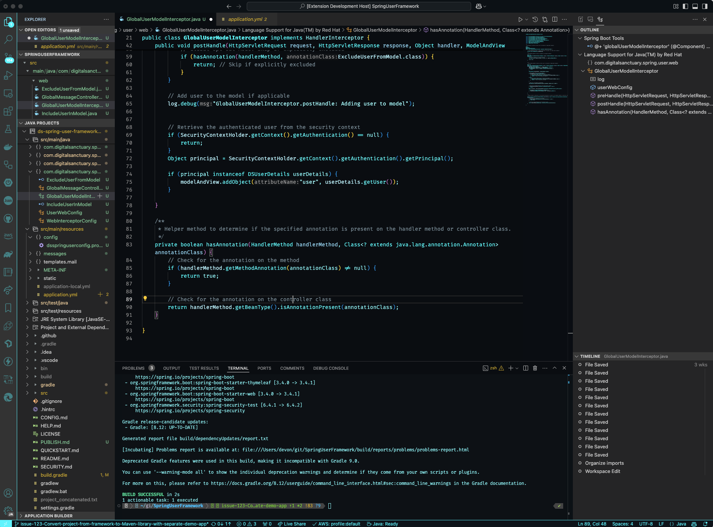
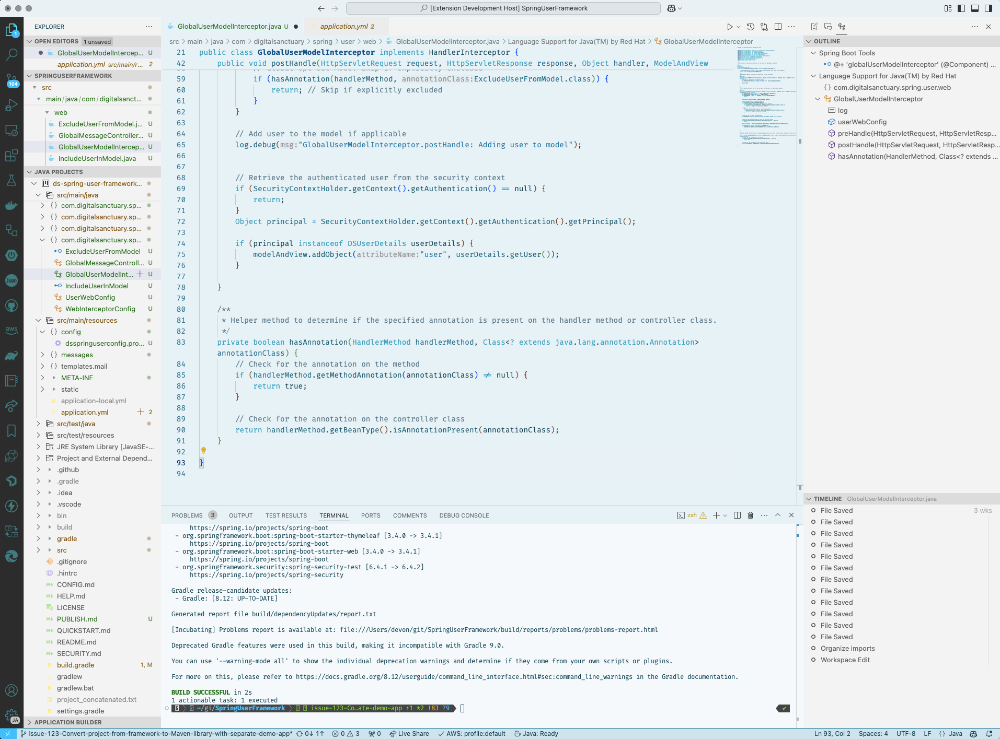

# Tron Legacy Theme

Welcome to the Tron Legacy Theme for Visual Studio Code! This theme is inspired by the iconic visuals of Tron Legacy, featuring sleek neon colors and a clean interface for developers who love futuristic aesthetics. The theme includes both light and dark variants to suit your preference.

## Features

- **Futuristic Design**: Inspired by Tron Legacy, this theme brings a futuristic look to your coding environment.
- **Light and Dark Variants**: Choose between the Tron Legacy Light and Tron Legacy Dark themes.
- **Neon Colors**: Vibrant neon colors for syntax highlighting and UI elements.
- **Clean Interface**: A clean and minimalistic design to keep you focused on your code.

## Installation

1. Open the Extensions view in VSCode by clicking on the Extensions icon in the Activity Bar on the side of the window or by pressing `Ctrl+Shift+X`.
2. Search for "Tron Legacy Theme".
3. Click on the "Install" button.
4. Once installed, go to the Command Palette (`Ctrl+Shift+P`) and type `Preferences: Color Theme`. Select either "Tron Legacy Theme Dark" or "Tron Legacy Theme Light".

## Screenshots

### Tron Legacy Dark Theme

### Tron Legacy Light Theme

## Contributing

If you find any issues or have suggestions for improvements, please open an issue on the [GitHub repository](https://github.com/devondragon/vscode-theme-tron/issues).

## License

This theme is licensed under the MIT License. See the [LICENSE.md](LICENSE.md) file for more details.

## Author

Created by Devon Hillard. You can reach out via [email](mailto:devon@digitalsanctuary.com) or visit [DigitalSanctuary](https://digitalsanctuary.com).

---

Enjoy coding with the Tron Legacy Theme!
